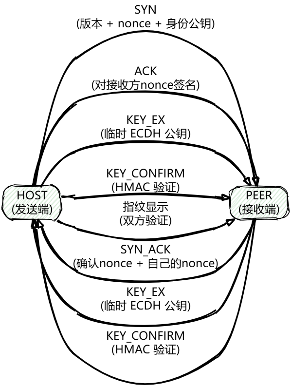
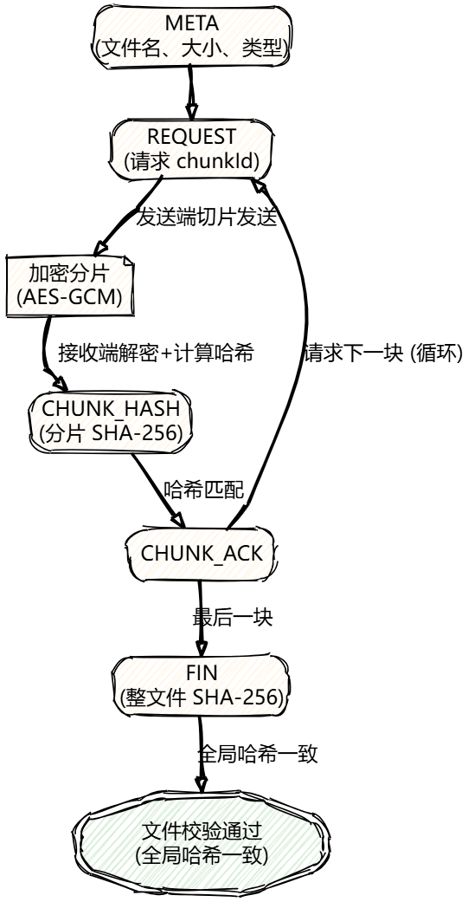
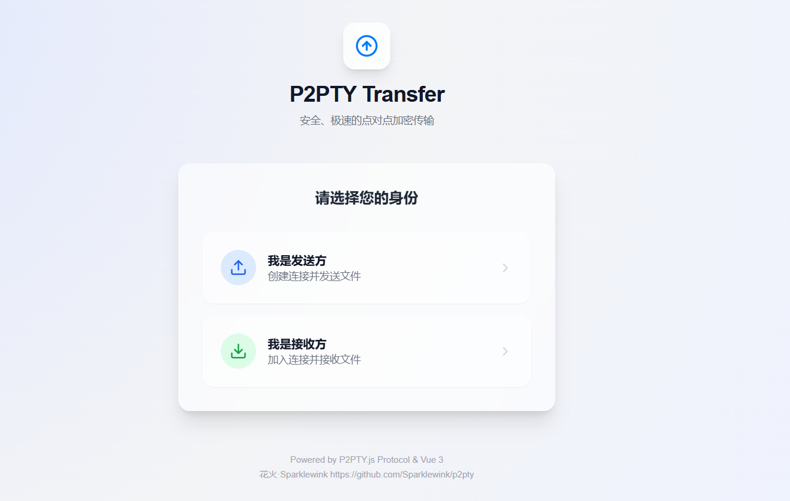
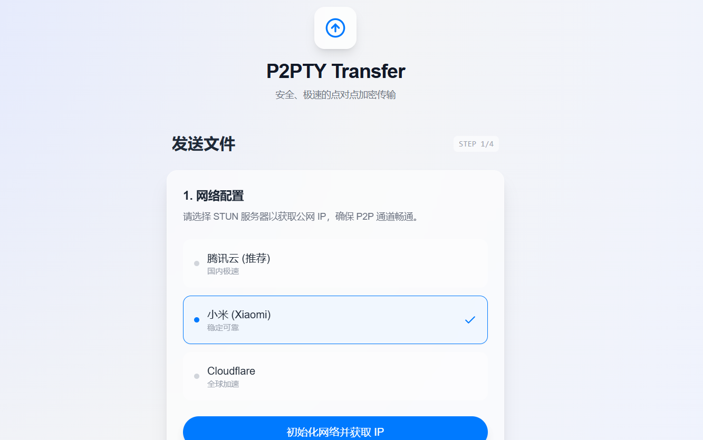
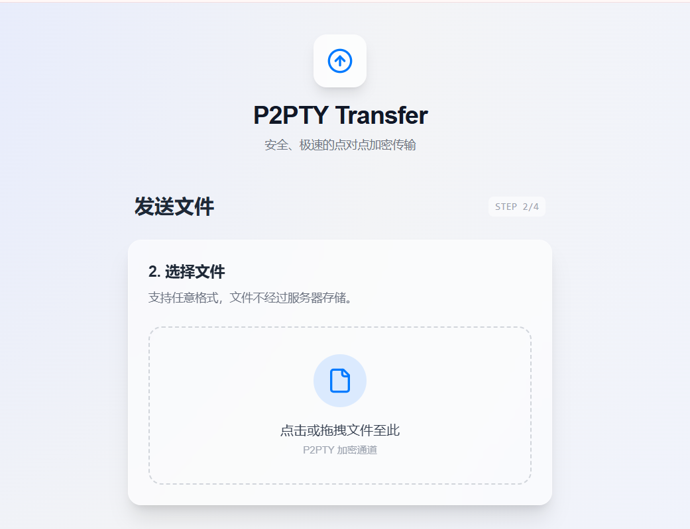

# P2PTY
**P2PTY** 是一个轻量级、高安全性的 WebRTC 点对点文件传输协议库。

它专为浏览器环境设计，通过 **ECDH 密钥交换** 和 **AES-GCM 加密** 实现了端到端加密（E2EE），并内置了分片哈希校验、自动重传和断点续传逻辑，确保文件传输的安全与可靠。

[](README.md)
[](docs/README_EN.md) 

## 目录

- [P2PTY](#p2pty)
- [核心特性](#-核心特性)
- [安装](#-安装)
- [网络配置指南 (STUN/TURN)](#-网络配置指南-stunturn)
  - [推荐 STUN 服务器列表](#推荐-stun-服务器列表)
  - [配置示例](#配置示例)
- [快速上手](#-快速上手)
  - [1. 主机端 (Host / Sender)](#1-主机端-host--sender)
  - [2. 客户端 (Peer / Receiver)](#2-客户端-peer--receiver)
- [API 文档](#-api-文档)
  - [配置对象 (Config)](#配置对象-config)
  - [方法 (Methods)](#方法-methods)
  - [事件 (Events)](#事件-events)
- [安全性设计](#️-安全性设计)
- [原理与架构](#-原理与架构)
- [常见问题与故障排查](#-常见问题与故障排查)
  - [1. 错误码对照表](#1-错误码对照表)
  - [2. 常见连接问题](#2-常见连接问题)
- [注意事项](#️-注意事项)
- [Demo](#demo)
- [Cloudflare Pages 部署](#-cloudflare-pages-部署)
  - [部署配置指南](#️-部署配置指南)
  - [配置 Cloudflare API Token](#️-配置-cloudflare-api-token解决-wrangler-认证错误)
  - [手动部署](#️手动部署)
- [License](#-license)

## ✨ 核心特性

* 🔒 **端到端加密**：使用 ECDH (P-384) 协商密钥，AES-256-GCM 加密数据通道，拒绝中间人监听。
* 📦 **可靠传输**：内置 16MB 分片机制，支持 SHA-256 实时完整性校验。
* 🔄 **自动纠错**：支持分片级哈希验证，数据损坏自动重传，无需重发整个文件。
* 🌍 **智能连接**：强制多 STUN/TURN 配置，利用 WebRTC 自动进行网络穿透和故障切换。
* 📝 **身份验证**：基于 ECDSA 的数字签名链接，确保连接方的身份可信。


## 📦 安装

目前 P2PTY 以 ES Module 形式提供。请确保你的环境支持 ES6+ 及 Web Crypto API。

```javascript
import { P2PTY } from './p2pty.js';
// 依赖项：需要确保环境中能访问 @noble/hashes (代码中已通过 esm.sh 引入)

```

## 🌐 网络配置指南 (STUN/TURN)

为了确保在不同网络环境下能成功建立 P2P 连接，**必须**配置有效的 ICE 服务器。

### 推荐 STUN 服务器列表

以下服务器访问速度快且稳定，建议在配置 `iceServers` 时组合使用：

| 提供商 | 地址 (URL) | 稳定性 | 备注 |
| --- | --- | --- | --- |
| **腾讯 (Tencent)** | `stun:stun.qq.com:3478` | ⭐⭐⭐⭐⭐ | 国内连通率极高 |
| **小米 (Xiaomi)** | `stun:stun.miwifi.com:3478` | ⭐⭐⭐⭐⭐ | 响应速度快 |
| **CloudFlare** | `stun:stun.cloudflare.com:3478` | ⭐⭐ | 建议作为备选 |

### 配置示例

在初始化 `P2PTY` 时，建议同时传入多个 STUN 地址，WebRTC 引擎会自动选择最快的一个：

```javascript
const iceConfig = [
    { urls: "stun:stun.qq.com:3478" },
    { urls: "stun:stun.miwifi.com:3478" },
    { urls: "stun:stun.cloudflare.com:3478" }
];

```

> **注意**：如果处于复杂的对称型 NAT 网络（如 4G/5G 或企业内网），仅使用 STUN 可能无法穿透。建议在生产环境中额外部署并配置 **TURN** 服务器（如 coTURN）。

---

## ⚡ 快速上手

P2PTY 需要你自己实现一个简单的信令通道（如 WebSocket）来交换 WebRTC 的 SDP 和 Candidate 信息。

### 1. 主机端 (Host / Sender)

主机负责生成连接链接并发送文件。

```javascript
import { P2PTY, CryptoUtils } from './p2pty.js';

async function startHost() {
    // 1. 生成主机身份密钥 (ECDSA)
    const identity = await CryptoUtils.generateIdentityKeyPair();

    // 2. 初始化实例 (配置STUN 服务器)
    const p2p = new P2PTY({
        role: 'HOST',
        identity: identity,
        iceServers: [
            { urls: "stun:stun.qq.com:3478" },      // 腾讯
            { urls: "stun:stun.miwifi.com:3478" }   // 小米
        ]
    });

    // 3. 处理信令 (需要将其发送给 Peer)
    p2p.on('onSignal', (data) => {
        console.log('生成的信令数据，请发送给 Peer:', JSON.stringify(data));
        // WebSocket.send(data)...
    });

    // 4. 监听连接成功
    p2p.on('onConnect', async () => {
        console.log('P2P 连接已建立！安全指纹:', p2p.getFingerprint());
        
        // 发送文件
        const fileInput = document.getElementById('fileInput');
        if (fileInput.files[0]) {
            await p2p.sendFile(fileInput.files[0]);
        }
    });

    // 5. 生成邀请链接 (包含公钥签名)
    const link = await p2p.generateLink("可选的Relay信息", 300); // 300秒过期
    console.log('邀请链接:', link);

    // 启动
    await p2p.start();
}

```

### 2. 客户端 (Peer / Receiver)

客户端通过连接字符串加入，并接收文件。

```javascript
import { P2PTY } from './p2pty.js';

async function startPeer(connectionString) {
    // 1. 初始化实例
    const p2p = new P2PTY({
        role: 'PEER',
        connectionString: connectionString, // 从 Host 获取的字符串
        iceServers: [
            { urls: "stun:stun.qq.com:3478" },      // 腾讯
            { urls: "stun:stun.miwifi.com:3478" }   // 小米
        ]
    });

    // 2. 处理信令 (需要发送回 Host)
    p2p.on('onSignal', (data) => {
        // WebSocket.send(data)...
    });

    // 3. 监听文件进度
    p2p.on('onFileProgress', (loaded, total) => {
        console.log(`传输进度: ${((loaded / total) * 100).toFixed(2)}%`);
    });

    // 4. 监听文件接收完成
    p2p.on('onFileVerified', (isSuccess) => {
        if (isSuccess) console.log('文件接收并校验成功！');
    });
    
    // 5. 获取文件块 (可选，用于流式处理)
    const receivedChunks = [];
    p2p.on('onFileChunk', (arrayBuffer) => {
        receivedChunks.push(arrayBuffer);
    });

    await p2p.start();
}

```

---

## 📖 API 文档

### 配置对象 (Config)

在 `new P2PTY(config)` 中传入：

| 属性名 | 类型 | 必填 | 描述 |
| --- | --- | --- | --- |
| `role` | `'HOST' 'PEER'` | ✅ | 当前实例的角色。 |
| `iceServers` | `RTCIceServer[]` | ✅ | **必须传入**。STUN/TURN 服务器列表。|
| `identity` | `CryptoKeyPair` | ❌ | **HOST 必填**。使用 `CryptoUtils.generateIdentityKeyPair()` 生成。 |
| `connectionString` | `String` | ❌ | **PEER 必填**。由 HOST 生成的包含签名和公钥的字符串。 |

### 方法 (Methods)

#### `start()`

启动 P2P 流程，开始搜集 ICE 候选者并生成 Offer (Host) 或准备接收 (Peer)。

#### `generateLink(relayPayload, expireSeconds)`

* **Host Only**。
* `relayPayload`: 任意字符串，可用于传递信令服务器的 Room ID 等信息。
* `expireSeconds`: 链接有效期，默认 300 秒。
* **返回**: 签名后的连接字符串。

#### `sendFile(fileBlob)`

* **Host Only**。
* `fileBlob`: JS `File` 对象或 `Blob` 对象。
* 开始分片、加密并发送文件。

#### `close()`

关闭数据通道和 PeerConnection，清理资源。

#### `getFingerprint()`

获取连接的安全指纹（SHA-256），双方可比对该指纹以确认未被中间人攻击。

### 事件 (Events)

使用 `p2p.on('eventName', callback)` 监听。

| 事件名 | 回调参数 | 描述 |
| --- | --- | --- |
| `onSignal` | `(data)` | **核心**。当 WebRTC 生成 SDP 或 ICE Candidate 时触发。需通过信令服务器转发给对方。 |
| `onConnect` | `()` | P2P 连接建立、密钥交换完成且握手成功时触发。 |
| `onFingerprint` | `(hexString)` | 密钥确认阶段生成的安全指纹。 |
| `onFileProgress` | `(loaded, total)` | 文件传输进度更新（字节）。 |
| `onFileChunk` | `(ArrayBuffer)` | 接收到一个校验通过的完整分片（默认 16MB）。 |
| `onFileVerified` | `(bool)` | 整个文件传输完成且全量 SHA-256 校验通过。 |
| `onError` | `(Error)` | 发生严重错误（如握手超时、密钥错误、断开连接）。 |
| `onReconnectNeeded` | `(lastChunkId)` | 连接意外断开，建议上层应用尝试重连。 |

---

## 🛡️ 安全性设计

1. **身份绑定**：`connectionString` 包含 Host 的 ECDSA 公钥和对链接参数的数字签名。Peer 在解析链接时会强制验证签名，防止链接被篡改。
2. **前向保密 (PFS)**：每次会话使用临时的 ECDH 密钥对协商共享密钥 (`session key`)。即使长期身份密钥泄露，也无法解密过去的历史流量。
3. **抗重放攻击**：协议握手阶段包含随机 `Nonce`，且加密数据包包含自增序列号 (`seq`)，防止重放攻击。
4. **数据完整性**：
* **分片级**：每个 16MB 分片独立计算 SHA-256，接收端实时校验。
* **文件级**：传输结束时比对全局 SHA-256 哈希，确保文件 100% 准确。


## 📝原理与架构

P2PTY 通过 **WebRTC 数据通道** + **强身份认证与密钥协商** + **应用层分片校验**，实现浏览器间的安全、可靠 P2P 文件传输。

### 整体架构


### 连接握手流程


### 文件传输与完整性校验流程


### 核心安全设计


## ❓ 常见问题与故障排查

如果在开发或测试过程中遇到问题，请参考以下错误码和解决方案。

### 1. 错误码对照表

P2PTY 会通过 `onError` 事件抛出 `ProtocolError`，包含以下 `code`：

| 错误码 (Code) | 含义 | 可能原因 | 建议解决方案 |
| --- | --- | --- | --- |
| `TIMEOUT_HANDSHAKE` | 握手超时 | 双方未在 60秒内完成连接建立。 | 1. 检查信令服务器是否正常转发消息。<br><br>2. 检查 STUN 服务器是否可用。<br><br>3. 双方网络是否存在防火墙拦截 UDP。 |
| `LINK_INVALID` | 链接无效 | 解析连接字符串失败。 | 1. 链接是否完整复制？<br><br>2. 链接是否已过期（默认 300秒）？<br><br>3. Host 端公钥签名验证失败。 |
| `MAX_RETRIES` | 校验失败过多 | 同一分片重传次数超过 5 次。 | 网络环境极差或存在恶意数据包注入。建议检查网络稳定性。 |
| `PC_CONN_LOST` | 连接中断 | WebRTC 底层连接断开。 | 网络波动或一方断网。可通过 `onReconnectNeeded` 尝试重连逻辑。 |
| `FILE_HASH_MISMATCH` | 文件校验失败 | 最终文件 SHA-256 不匹配。 | 极其罕见。说明传输过程中发生了哈希碰撞或逻辑错误。需重新传输文件。 |
| `MITM_ALERT` | 中间人警告 | 公钥或指纹不匹配。 | 可能存在中间人攻击，停止传输并检查信令通道安全性。 |

### 2. 常见连接问题

#### Q: 为什么一直卡在 `SIGNALING` 状态，无法连接？

**A:** 这通常是 **ICE 穿透失败** 导致的。

* **检查 STUN 配置**：确保 `iceServers` 中配置了国内可用的 STUN 地址（如腾讯、小米）。
* **对称型 NAT**：如果一方处于 4G/5G 网络或企业内网（对称型 NAT），仅依靠 STUN 可能无法穿透。此时**必须配置 TURN 服务器**（中继服务器）。

#### Q: 报错 `must provide 'iceServers'`？

**A:** P2PTY 不内置默认 STUN 服务器。你必须在初始化时显式传入 `iceServers` 数组。

#### Q: 传输大文件时内存占用过高？

**A:** P2PTY 默认分片大小为 16MB。接收端会将分片暂存在内存中进行校验。如果设备内存受限，可以尝试在源码中减小 `CHUNK_SIZE`（如改为 4MB），但这会稍微增加哈希计算的频次。

#### Q: 如何判断连接是否加密安全？

**A:** 在 `onConnect` 回调中调用 `p2p.getFingerprint()`。你可以让用户在界面上口头或通过其他渠道核对双方的指纹（Fingerprint）前几位是否一致。这是 WebRTC 安全的最佳实践。

## ⚠️ 注意事项

1. **信令服务器**：本库不包含信令服务器（Signal Server）。你需要自己搭建一个简单的 WebSocket 服务来在 Host 和 Peer 之间交换 `onSignal` 产生的数据。
2. **ICE 服务器**：为了保证在复杂网络（如 4G/5G、对称型 NAT）下的连通率，请务必在 `iceServers` 中配置可用的 TURN 服务器。

## ⚡Demo

项目基于Vue.js开发了一个演示站，可用于体验。
https://p2pty.lty.qzz.io





你也可用在cloudflare上部署此demo项目
## ☁️ Cloudflare Pages 部署

本项目支持使用 Cloudflare 一键部署。点击下方按钮即可开始：

[](https://deploy.workers.cloudflare.com/?url=https://github.com/Sparklewink/p2pty)

### ⚙️ 部署配置指南

点击按钮跳转后，您会看到配置页面。由于项目结构特殊，请按照下图表格修改默认配置，否则会导致构建失败：

| 配置项 (Field) | 填写内容 (Value) |  说明 |
| --- | --- | --- |
| **构建命令** (Build Command) | `cd transfer && npm install && npm run build` |必须先进入子目录才能构建 |
| **部署命令** (Deploy Command) | `npx wrangler pages deploy transfer/dist` | 显式指定发布 `dist` 静态目录 |
| **路径** (Path) | `/` | 保持默认即可 |


### ⚙️ 配置 Cloudflare API Token（解决 wrangler 认证错误）

项目使用 Cloudflare Pages 自动构建 + wrangler 部署时，如果出现类似以下错误：

```
Authentication error [code: 10000]
Please ensure it has the correct permissions for this operation.
```

说明 wrangler 缺少足够的 API 权限。请按以下步骤创建并配置专用的 API Token：

1. 登录 Cloudflare 仪表盘：https://dash.cloudflare.com  
   点击右上角头像 → **My Profile** → **API Tokens**（或直接访问：https://dash.cloudflare.com/profile/api-tokens）

2. 点击 **Create Token**（创建令牌）

3. 选择 **Create Custom Token**（自定义令牌）或使用模板后修改：
   - Token 名称：建议填 `p2pty-pages-deploy-token`（便于识别）
   - **Permissions**（权限） - 添加以下至少一项（推荐全选以防万一）：
     - **Account** → **Cloudflare Pages** → **Edit**（**必须**，否则 10000 错误）
     - **Account** → **Workers Scripts** → **Edit**（推荐，wrangler 常用）
     - **User** → **User Details** → **Read**（可选，但保险）
   - **Account Resources**（账号范围）：
     - 选择 **All accounts**（包含所有账号），或明确选中你的账号（ID: 2982c212c4ac2c12419559409eed8b24）
   - **Zone Resources**：**None**（Pages 项目不需要 Zone 权限）

4. 点击 **Continue to summary** → **Create Token**  
   → 立即复制生成的 **Token 值**（只显示一次，丢失需重新创建）

5. 回到你的 Cloudflare Pages 项目（https://dash.cloudflare.com → Pages → 你的项目 p2pty-transfer）：
   - 点击 **Settings** → **Environment variables**（环境变量）
   - 添加变量：
     - **变量名称**：`CLOUDFLARE_API_TOKEN`（必须全大写）
     - **值**：粘贴刚才复制的 Token
     - **类型**：选择 **Encrypted**（加密，推荐）
   - 保存

6. 触发重新部署：
   - 在 Pages 项目页面点击 **Deployments** → 找到最新失败的构建 → 点击 **Retry deployment**  
     或 push 一个空 commit（`git commit --allow-empty -m "trigger redeploy"`）来重新触发

完成后，wrangler 就能正常调用 Cloudflare API 完成 `npx wrangler pages deploy transfer/dist` 步骤。

### ☁️手动部署
  1.或者，fork本仓库
  
  2.登录 Cloudflare 仪表盘：https://dash.cloudflare.com  
  
  3.计算和AI -> Workers and Pages
  
  4.创建部署 -> 创建Pages
  
  5.导入现有 Git 存储库
  
  6.选择本项目
  
  7.构建命令(Build Command) -> `cd transfer && npm install && npm run build`


## 📄 License

Apache-2.0
